Product-service服务集成flyway插件操作步骤

1、在pom.xml文件中，添加依赖

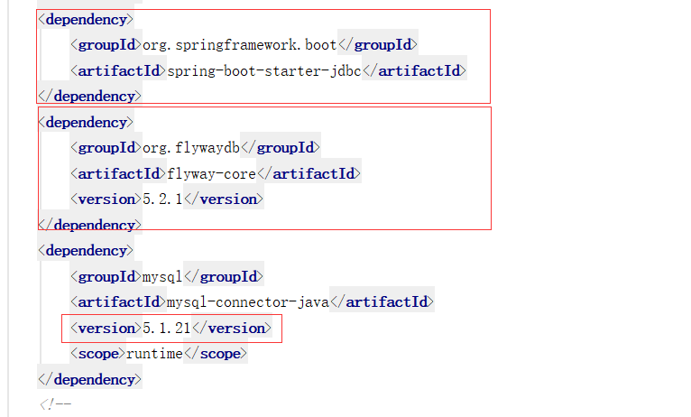

其中jdbc链接驱动版本号（5.1.2），本次测试需要添加，本地mysql数据库版本号5.7.9，更高版本数据库，没有进行测试。

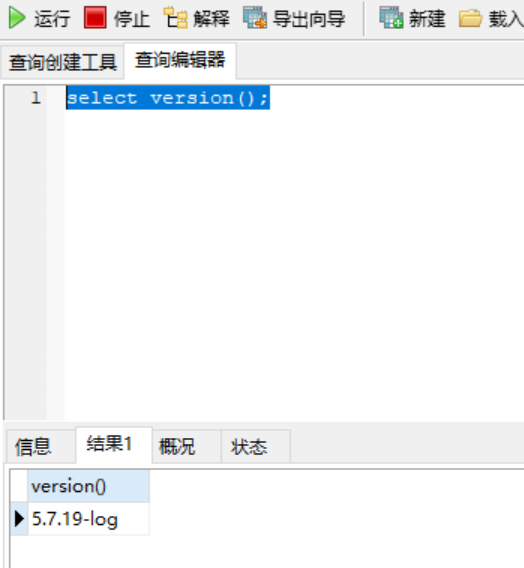

2、在pom.xml文件中，添加新的插件

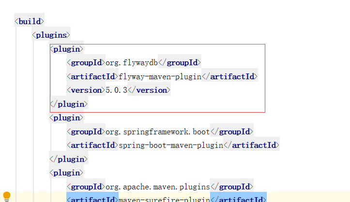

3、修改数据库链接参数配置文件

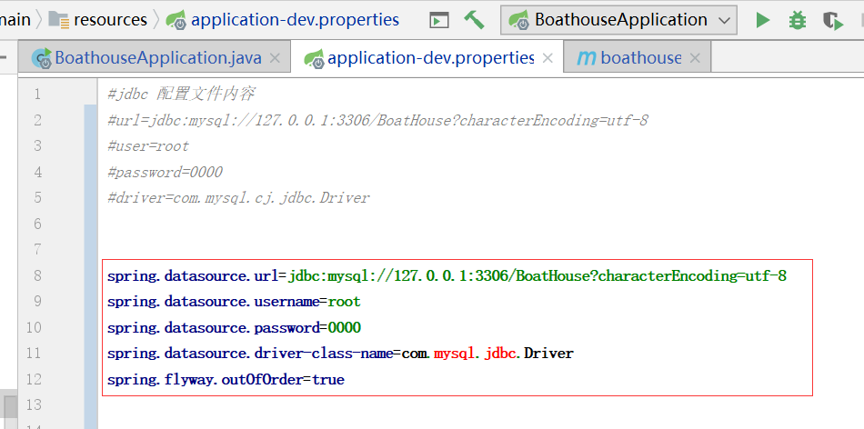

4、在resource/db目录下，新建数据库版本控制文件/migration/V1.0\_\_init.sql

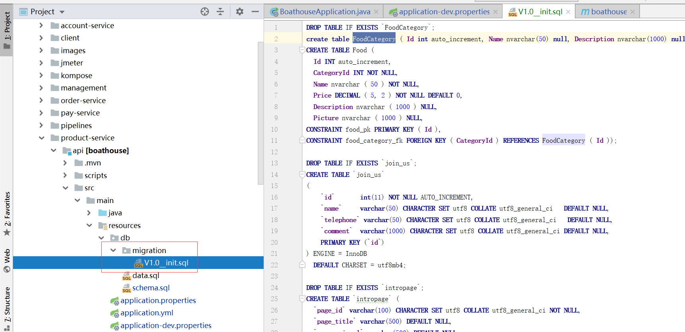

5、清空数据表，运行程序，进行测试

运行前

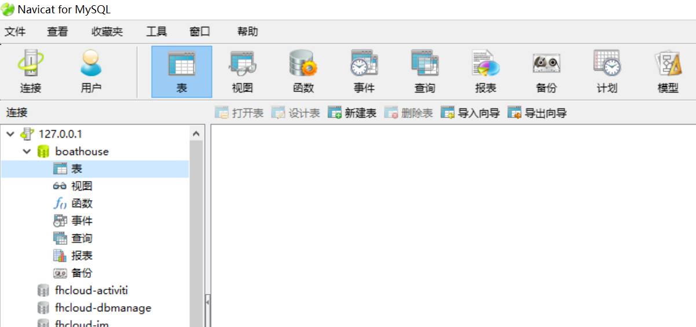

运行后

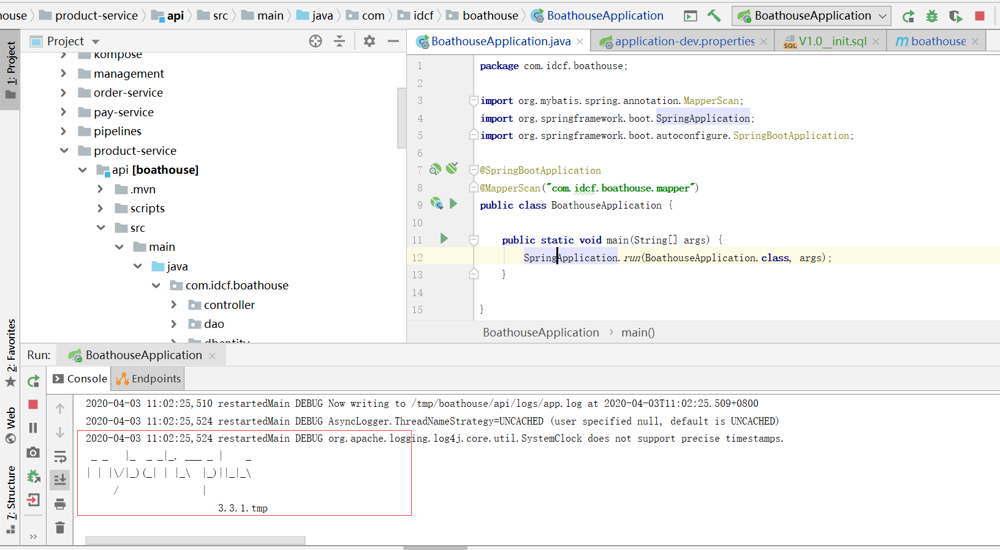

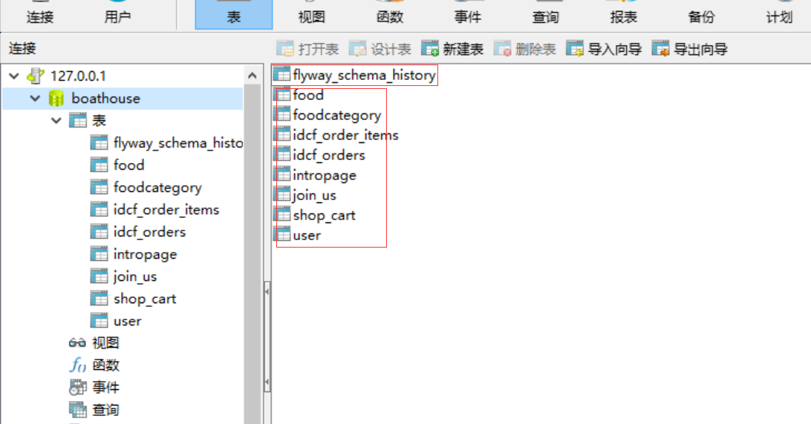

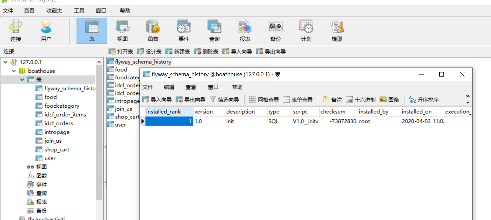

6、添加新的数据库版本文件，进行测试

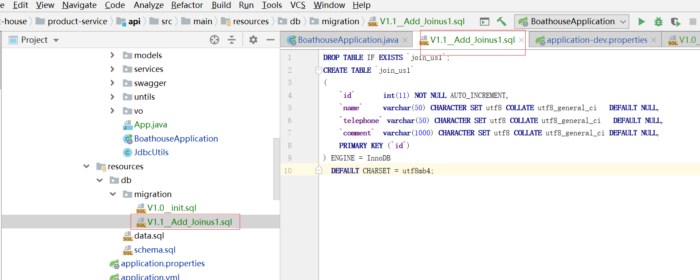

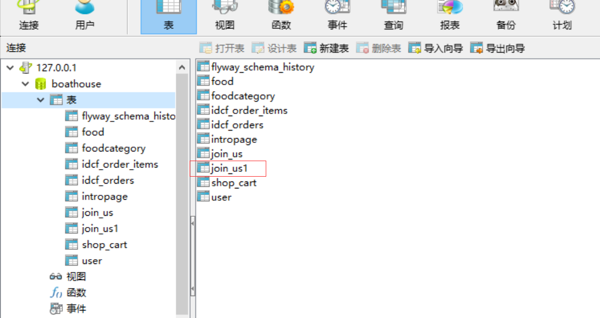

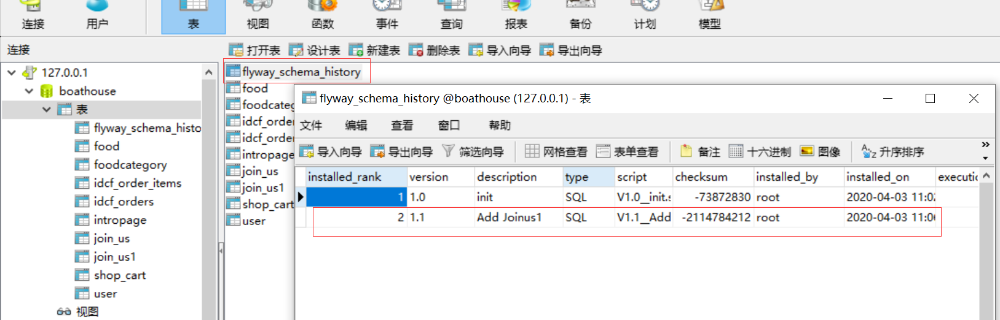
